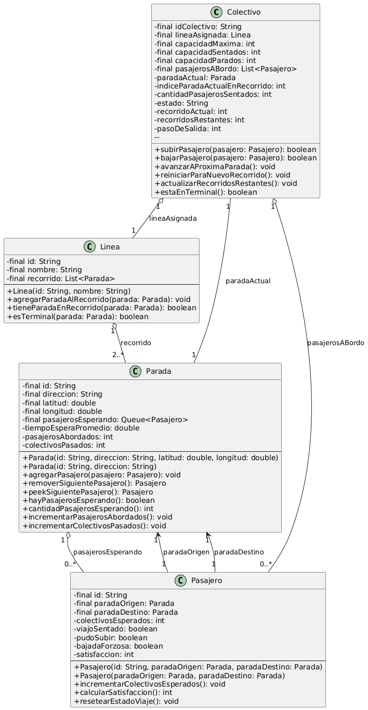

# Simulador de Colectivos Urbanos  
## Informe Final

**Trabajo Práctico Integrador – Incremento 2**  
Cátedra: AyP2 – UNPSJB

**Desarrolladores:**  
- Miyen Brandolino  
- Enzo Riera

**Fecha de entrega:** 24 de junio de 2025

---

## Introducción


El presente documento detalla el desarrollo del proyecto "Simulador de Colectivos Urbanos", un sistema implementado en Java bajo el paradigma de orientación a objetos. El objetivo principal es modelar la dinámica de una red de transporte público para analizar su rendimiento, enfocándose en el flujo de pasajeros, la gestión de la capacidad de los vehículos y la eficiencia general del servicio.

A lo largo de su desarrollo, el proyecto ha evolucionado hasta convertirse en una robusta herramienta de simulación, cuya arquitectura modular y clara separación de responsabilidades ha sido validada por una exhaustiva suite de pruebas. Este informe expondrá el planteo del problema, la arquitectura de la solución diseñada, su implementación y los resultados obtenidos en las pruebas.

## 2. Planteo del Problema

El problema a resolver es la creación de un simulador del sistema de transporte público urbano de Puerto Madryn para analizar su eficiencia. El objetivo es modelar las interacciones entre las entidades clave del sistema —líneas, colectivos, paradas y pasajeros— para generar y evaluar métricas de rendimiento.

Para lograrlo, la solución debe abordar los siguientes requerimientos específicos:

- **Modelado de la Red:** Representar la topología del sistema, incluyendo las líneas con sus recorridos fijos de paradas y los colectivos asociados a cada una.
- **Gestión de Capacidad y Recorridos:** Simular que cada colectivo tiene una capacidad limitada de pasajeros y que debe realizar múltiples vueltas a su recorrido.
- **Comportamiento de Pasajeros:** Modelar el ciclo de vida de un pasajero, desde su llegada a una parada de origen hasta que se baja en su destino.
- **Generación de Indicadores (KPIs):** Calcular y reportar métricas de rendimiento, como un Índice de Satisfacción del Pasajero y la Ocupación Promedio de los vehículos, basados en los datos generados durante la simulación.

## 3. Análisis de las Estructuras de Datos Seleccionadas

La elección de las estructuras de datos es fundamental para la eficiencia y correcta funcionalidad del simulador. A continuación, se fundamenta la selección de la implementación concreta para cada Tipo Abstracto de Datos (TAD) utilizado en los componentes clave del proyecto, basándose en su complejidad algorítmica (Notación Big O) y su adecuación al caso de uso.

### 3.1. Cola de Pasajeros en Paradas

- **Componente:** `modelo.Parada` (atributo `pasajerosEsperando`)
- **TAD requerido:** Cola (`Queue`), para modelar el comportamiento "Primero en Entrar, Primero en Salir" (FIFO) de las personas que esperan.
- **Implementación seleccionada:** `java.util.LinkedList`

**Justificación:**  
Se eligió `java.util.LinkedList` por su rendimiento óptimo para operaciones de cola. Añadir un pasajero al final (`offer(e)`) y quitarlo del inicio (`poll()`) son operaciones de tiempo constante, $O(1)$. Una alternativa como `ArrayList` sería ineficiente, ya que eliminar el primer elemento tiene una complejidad de $O(n)$, lo cual no es aceptable para una operación tan frecuente en la simulación.

### 3.2. Recorrido de una Línea

- **Componente:** `modelo.Linea` (atributo `recorrido`)
- **TAD requerido:** Lista (`List`), para almacenar la secuencia ordenada de paradas.
- **Implementación seleccionada:** `java.util.ArrayList`

**Justificación:**  
El recorrido de una línea se construye una vez y luego se consulta frecuentemente. `ArrayList` es ideal para este escenario, ya que el acceso por índice (`get(i)`) es en tiempo constante, $O(1)$, operación crucial para que el colectivo avance en su ruta. Dado que no se realizan inserciones o eliminaciones en medio del recorrido, la pobre performance de `ArrayList` para esas operaciones es irrelevante.

### 3.3. Almacenamiento de Datos en Memoria

- **Componente:** `datos.LectorArchivos`
- **TAD requerido:** Mapa (`Map`), para asociar un ID único (`String`) con su objeto (`Parada` o `Linea`).
- **Implementación seleccionada:** `java.util.TreeMap`

**Justificación:**  
Aunque `HashMap` ofrece un rendimiento promedio de $O(1)$, se eligió `TreeMap` ($O(\log n)$) deliberadamente por una ventaja clave para este proyecto: mantiene las claves ordenadas. Esta característica garantiza que al iterar sobre los datos cargados, el orden sea siempre predecible, lo que facilita enormemente la depuración y la reproducibilidad de los resultados de la simulación.
3.4. Almacenamiento de Datos en Memoria para Impresión Ordenada

• Componente: interfaz.SimuladorUI
• TAD requerido: Mapa (Map), para asociar un ID único (String) con la lista de eventos (List<String>) de cada colectivo.
• Implementación seleccionada: java.util.LinkedHashMap

Justificación:
Aunque HashMap ofrece un rendimiento promedio de $O(1)$, se eligió LinkedHashMap por una ventaja clave: preserva el orden de inserción de las claves. Esto asegura que, al mostrar los resultados o eventos de la simulación al usuario, la salida respete el mismo orden en que se generaron los datos. Esta característica hace que la presentación sea más intuitiva y fácil de seguir, además de mantener la consistencia entre ejecuciones


# 4. Diagrama de Clases

A continuación, se presenta el diagrama de clases UML que representa la arquitectura del paquete modelo del proyecto. Este diagrama ilustra las clases principales (`Colectivo`, `Linea`, `Parada`, `Pasajero`), sus atributos fundamentales y las relaciones de asociación y agregación que existen entre ellas.

Como se puede observar, el diseño sigue el principio de encapsulamiento al declarar todos los atributos como `private`, gestionando las interacciones a través de métodos públicos. La cardinalidad de las relaciones refleja las reglas del negocio, como que una `Linea` se compone de múltiples `Parada`s o que un `Colectivo` puede tener varios `Pasajero`s a bordo.

*(El código PlantUML utilizado para generar este diagrama se encuentra en los archivos fuente del proyecto para su consulta).*

---

# Descripción del Diagrama UML del Paquete `proyectointegrador.modelo`

Este documento detalla la estructura y las relaciones de las clases principales del modelo: `Colectivo`, `Linea`, `Parada` y `Pasajero`, según su implementación real en el código fuente.

## 1. Clases y sus Relaciones

**Colectivo**
- Modela un vehículo de transporte colectivo.
- Tiene una **Agregación** con `Linea` (cada colectivo pertenece a una línea concreta, pero la línea existe independientemente).
- Tiene una **Agregación** con `Pasajero` (a través de su lista `pasajerosABordo`).
- Tiene una **Asociación** con `Parada` (referencia a `paradaActual`).

**Linea**
- Representa una ruta de transporte determinada.
- Tiene una **Agregación** con `Parada` (lista ordenada `recorrido` que define el trayecto).

**Parada**
- Representa una ubicación física donde los pasajeros esperan.
- Tiene una **Agregación** con `Pasajero` (cola `pasajerosEsperando` de los que esperan en la parada).

**Pasajero**
- Modela a una persona usuaria del sistema de transporte.
- Tiene **Asociaciones** con dos instancias de `Parada`: `paradaOrigen` y `paradaDestino`.

## 2. Atributos principales y visibilidad

Todos los atributos son `private` y la mayoría son `final` (inmutables tras la construcción), salvo los de estado (que pueden cambiar durante la simulación). El acceso es por métodos públicos (getters/setters) según buenas prácticas de Java.

### Colectivo

- `- final idColectivo: String`
- `- final lineaAsignada: Linea`
- `- final capacidadMaxima: int`
- `- final capacidadSentados: int`
- `- final capacidadParados: int`
- `- final pasajerosABordo: List<Pasajero>`
- `- paradaActual: Parada`
- `- indiceParadaActualEnRecorrido: int`
- `- cantidadPasajerosSentados: int`
- `- estado: String`
- `- recorridoActual: int`
- `- recorridosRestantes: int`
- `- pasoDeSalida: int`

### Linea

- `- final id: String`
- `- final nombre: String`
- `- final recorrido: List<Parada>`

### Parada

- `- final id: String`
- `- final direccion: String`
- `- final latitud: double`
- `- final longitud: double`
- `- final pasajerosEsperando: Queue<Pasajero>`
- `- tiempoEsperaPromedio: double`
- `- pasajerosAbordados: int`
- `- colectivosPasados: int`

### Pasajero

- `- final id: String`
- `- final paradaOrigen: Parada`
- `- final paradaDestino: Parada`
- `- colectivosEsperados: int`
- `- viajoSentado: boolean`
- `- pudoSubir: boolean`
- `- bajadaForzosa: boolean`
- `- satisfaccion: int`

## 3. Detalle de relaciones y cardinalidad

- `Colectivo "1" o-- "1" Linea`
- `Colectivo "1" o-- "0..*" Pasajero`
- `Colectivo "1" -- "1" Parada`
- `Linea "1" o-- "2..*" Parada`
- `Parada "1" o-- "0..*" Pasajero`
- `Pasajero "1" --> "1" Parada` (origen)
- `Pasajero "1" --> "1" Parada` (destino)

---



---

## 5. Implementación de la Solución

La solución propuesta sigue una arquitectura modular por capas, facilitando la mantenibilidad, la extensibilidad y la claridad del sistema. A continuación, se describen las funciones y responsabilidades principales de cada parte del simulador.

### 5.1. Arquitectura General por Capas y Clases

El sistema está organizado en los siguientes paquetes, cada uno con responsabilidades bien delimitadas:

- **`datos`**
  - `LectorArchivos`: Encargada de la carga e interpretación de archivos de configuración y datos (`.txt`, `config.properties`). Transforma los datos crudos en instancias de entidades del dominio.

- **`modelo`**
  - `Colectivo`: Representa un colectivo individual, su línea asignada, capacidad y pasajeros a bordo.
  - `Linea`: Define una línea de colectivo, incluyendo su recorrido y paradas asociadas.
  - `Parada`: Modela una parada, gestionando la cola de pasajeros que esperan.
  - `Pasajero`: Encapsula el origen, destino y estado de viaje de cada pasajero.

- **`logica`**
  - `Simulador`: Núcleo de la simulación. Gestiona el bucle principal, el avance de los colectivos, la gestión de pasajeros y la interacción con los demás módulos lógicos.
  - `GestorEstadisticas`: Recolecta eventos relevantes durante la simulación y calcula indicadores de rendimiento (KPIs).
  - `GeneradorPasajeros`: Responsable de la creación y asignación inicial de pasajeros al sistema.
  - `SimuladorHelper`: Provee funciones auxiliares para la operación y flujo de la simulación.

- **`util`**
  - `EventoUtils`: Utilidades para el procesamiento de eventos y manejo de textos auxiliares.

- **`reporte`**
  - `ReporteSimulacion`: Toma los datos recolectados durante la simulación y los transforma en reportes estructurados y legibles para el usuario.

- **`interfaz`**
  - `SimuladorColectivosApp`: Punto de entrada de la aplicación. Inicializa la simulación y gestiona el ciclo de vida de la interfaz.
  - `SimuladorConfig`: Permite configurar parámetros de la simulación antes de ejecutarla.
  - `SimuladorController`: Orquesta la interacción entre la UI y la lógica del simulador.
  - `SimuladorUI`: Se encarga de la interacción directa con el usuario, mostrando menús y resultados.

Esta organización modular permite una clara separación de responsabilidades y facilita la colaboración, el testing y la evolución futura del sistema.

---
### 5.2. Carga de Datos y Configuración

La inicialización del sistema comienza con la lectura de los archivos de configuración y datos, tarea llevada a cabo por la clase `LectorArchivos` del paquete `datos`. Esta clase interpreta la estructura de los archivos `.txt` y el archivo `config.properties`, creando las instancias iniciales de `Linea`, `Parada`, `Colectivo` y otros elementos necesarios para la simulación. Esta abstracción permite modificar los escenarios de simulación simplemente cambiando los archivos de entrada, sin necesidad de alterar el código fuente.


### 5.3. Lógica Central de la Simulación

El corazón del sistema reside en la clase `Simulador` (paquete `logica`). La simulación avanza a través de un bucle principal que representa el paso del tiempo en unidades discretas ("ciclos" o "pasos"). En cada ciclo, el simulador ejecuta una secuencia de acciones clave:

- Mueve cada colectivo a su próxima parada de acuerdo a su recorrido.
- Gestiona el descenso de pasajeros cuyo destino es la parada actual.
- Permite el ascenso de nuevos pasajeros desde la cola de espera, respetando la capacidad máxima del colectivo.
- Registra eventos relevantes para el posterior análisis de desempeño.

Este diseño permite observar la evolución dinámica del sistema y analizar el impacto de diferentes configuraciones sobre el flujo y la satisfacción de los pasajeros.

### 5.4. Módulos de Análisis y Generación de Reportes

Durante la simulación, el `Simulador` delega tareas especializadas a otros componentes de la capa lógica:

- **GestorEstadisticas:** Registra y procesa eventos clave (como tiempos de espera, ocupación de colectivos, cantidad de pasajeros transportados), permitiendo la generación de indicadores de rendimiento (KPIs) al finalizar la simulación.

Al concluir la simulación, la clase `ReporteSimulacion` del paquete `reporte` toma los datos recolectados y los presenta de manera clara y formateada. La capa `interfaz` se encarga de mostrar estos resultados al usuario, ya sea en consola o a través de otros medios de presentación.

---

Esta estructura por capas garantiza una sólida separación de responsabilidades, facilitando futuras ampliaciones o modificaciones y permitiendo una experiencia de usuario confiable y reproducible.


## 6. Manual de Funcionamiento

Esta sección describe cómo configurar, ejecutar y utilizar el simulador, así como la interpretación de los resultados obtenidos.

### 6.1. Ingreso y Configuración de Datos

La simulación se configura a través del archivo  
`simulador-colectivos1/src/main/resources/config.properties`.  
Los parámetros clave que pueden personalizarse son:

- **`linea`**: Nombre del archivo con los datos de las líneas de la red (ejemplo: `lineas_pm_mapeadas.txt`).
- **`parada`**: Nombre del archivo con los datos de las paradas (ejemplo: `paradas_pm_mapeadas.txt`).
- **`cantidadPasajeros`**: Número total de pasajeros a generar para la simulación.

**Parámetros relacionados con colectivos:**

- **`capacidadColectivo`**: Capacidad máxima total de pasajeros por colectivo (incluye sentados y parados).
- **`capacidadSentadosColectivo`**: Capacidad de pasajeros que pueden viajar sentados en cada colectivo.
- **`cantidad_de_colectivos_simultaneos_por_linea`**: Número de colectivos que operan simultáneamente en cada línea.
- **`recorridos_por_colectivo`**: Cantidad de recorridos completos que debe realizar cada colectivo durante la simulación.
- **`frecuencia_salida_colectivos_minutos`**: Tiempo (en minutos simulados) entre la salida de dos colectivos consecutivos en la misma línea.

> *Nota:* Los archivos de datos y otros parámetros pueden modificarse para simular distintos escenarios y escalas de operación.

### 6.2. Instalación y Ejecución

**Requisitos previos:**
- Java Development Kit (JDK) 21 o superior
- Apache Maven 3.x o superior
- Git

**Pasos básicos:**
1. Clonar el repositorio y construir la librería de estructuras de datos local:
   ```bash
   git clone https://github.com/MiyoBran/simulador-colectivos.git
   cd simulador-colectivos/datastructures-library
   mvn clean install
   ```
2. Construir el proyecto principal:
   ```bash
   cd ../simulador-colectivos1
   mvn clean package
   ```
3. Ejecutar el simulador:
   ```bash
   java -jar target/simulador-colectivos1-0.0.1-SNAPSHOT.jar
   ```

**Desde un IDE:**  
Importar el proyecto como Maven y ejecutar la clase  
`proyectointegrador.interfaz.SimuladorColectivosApp`.

### 6.3. Menú Principal e Interacción

Al iniciar la aplicación, se presenta el siguiente menú de opciones en consola:

```
--- MENÚ PRINCIPAL ---
1. Ejecutar simulación completa
2. Ver estadísticas de la simulación
0. Salir
Seleccione una opción:
```

**Opciones y funcionalidades:**
- **Opción 1:** Ejecuta la simulación completa hasta que todos los pasajeros hayan llegado a destino o no queden nuevos eventos por procesar, mostrando los eventos agrupados por colectivo.
- **Opción 2:** Muestra un reporte completo con los principales indicadores de desempeño (KPIs), incluyendo:
    - **Índice de Satisfacción del Cliente** (Anexo I)
    - **Ocupación Promedio de Colectivos** (Anexo II)
    - Estadísticas adicionales: total de pasajeros transportados, cantidad de pasajeros que no pudieron subir, etc.

### 6.4. Interpretación de Resultados

- **Eventos en tiempo real:** Las opción 1 muestra, en bloque, los eventos de la simulación para facilitar el seguimiento del sistema.
- **Reporte de estadísticas:** Opción 2 ofrece los KPIs más relevantes para evaluar la calidad del servicio simulado y la eficiencia operativa del sistema.

### 6.5. Documentación y Recursos Adicionales

Para mayor detalle sobre la lógica, los requisitos y la arquitectura, consulte los siguientes archivos en  
`src/main/resources/`:

- `README.md`: Instrucciones completas de instalación y ejecución.
- `prompt-proyecto.md`: Resumen general del proyecto y objetivos.
- `roadmap-proyecto.md`: Plan de desarrollo e historia de los incrementos.
- `Laboratorio-requisitos-y-logica-simulacion2025.txt`: Requisitos funcionales y lógica interna de la simulación.
- `TAD-decisiones.md`: Detalles y justificación de las estructuras de datos empleadas.

---

*El simulador ha sido validado por una suite de más de 100 pruebas unitarias (JUnit 5), asegurando robustez y correcto funcionamiento en distintos escenarios.*

## 7. Problemas Detectados y Solucionados

Durante el desarrollo iterativo del simulador se identificaron y resolvieron numerosos problemas, tanto funcionales como de calidad de código, que permitieron robustecer la aplicación y sentar bases sólidas para su extensión y mantenimiento. A continuación se resumen los principales inconvenientes y sus soluciones, agrupados por temática:

### 7.1. Refactorización y Calidad de Código

- **Problema:** El código inicial presentaba desorganización interna, falta de documentación y presencia de código comentado u obsoleto, lo que dificultaba la colaboración y el mantenimiento.
- **Soluciones implementadas:**
  - Reorganización de clases en bloques lógicos (atributos, constructores, métodos públicos, etc.).
  - Documentación Javadoc completa para clases y métodos públicos.
  - Encapsulamiento estricto de atributos y uso de `final` donde correspondía.
  - Conversión de clases utilitarias a patrón "utility class" (`final` y constructor privado).
  - Eliminación de código muerto o redundante.
  - Centralización de la lógica de configuración en una única clase.

### 7.2. Bugs Funcionales y de Simulación

- **Problema:** Se detectaron errores en la gestión de recorridos, incluyendo:
  - `ConcurrentModificationException` al procesar la bajada de pasajeros.
  - Simular paso a paso.
  - Errores en el manejo de los asientos.	
  - Errores en la inicialización de colectivos y en la asignación de capacidades sentados/parados.
- **Soluciones implementadas:**
  - Mejoras en la gestión de colecciones para evitar modificaciones concurrentes.
  -Cambiar la lógica con la cual eran asignados los asientos a los pasajeros.
  - Refactorización de la inicialización de colectivos y parámetros, alineando la configuración (`config.properties`) con la lógica del sistema.

### 7.3. Validación y Manejo de Errores

- **Problema:** Falta de validación robusta de datos de entrada desde archivos, y potenciales errores en el cálculo de rutas con paradas nulas.
- **Soluciones implementadas:**
  - Validación estricta de campos obligatorios en la carga de datos, con advertencias claras en consola.
  - Guard clauses en métodos de planificación de rutas para evitar excepciones por entradas incorrectas o incompletas.

### 7.4. Reportes y Legibilidad de Salida

- **Problema:** La salida por consola era poco estructurada y difícil de leer, con mensajes inconsistentes y poco descriptivos.
- **Soluciones implementadas:**
  - Unificación del formato de salida usando `String.format`.
  - Mejora de los reportes estadísticos, agrupando eventos por colectivo y presentando información relevante de manera clara.
  - Incorporación de etiquetas descriptivas para colectivos y reportes de ocupación promedio.

### 7.5. Testing y Cobertura de Pruebas

- **Problema:** Cambios estructurales en el código requerían adaptar y mejorar las pruebas unitarias, que en ocasiones tenían nomenclatura poco clara o dependencias no actualizadas.
- **Soluciones implementadas:**
  - Refactorización de tests utilizando clases anidadas y descripciones detalladas.
  - Actualización de constructores y dependencias en los tests para reflejar cambios en el modelo de datos.
  - Eliminación de impresiones innecesarias y mejora de la modularidad de las pruebas.
  - Inclusión de dependencias modernas como `mockito-core` y `mockito-inline` para pruebas con Java 21.

### 7.6. Documentación y Onboarding

- **Problema:** Guías de colaboración y documentación estaban desactualizadas o dispersas, dificultando el onboarding de nuevos desarrolladores.
- **Soluciones implementadas:**
  - Consolidación de la documentación en un único `README.md` detallado.
  - Remoción de archivos obsoletos y redundantes.
  - Inclusión de un documento específico para la justificación de estructuras de datos (`TAD-decisiones.md`) y mejores prácticas.

---

Estos esfuerzos de detección y solución de problemas permitieron alcanzar una versión final más robusta, clara y fácil de mantener, tanto para usuarios finales como para futuros colaboradores del proyecto.

> **Nota:** Puedes consultar el historial completo de Pull Requests y cambios realizados en el repositorio para obtener mayor detalle sobre la evolución y resolución de incidencias:  
> [Historial de Pull Requests en GitHub](https://github.com/MiyoBran/simulador-colectivos/pulls?state=all)


### 8. Lotes de Prueba y Validación

El sistema fue validado exhaustivamente mediante una batería de **107 pruebas unitarias y de integración**, distribuidas en todos los paquetes lógicos y de modelo. El diseño de los tests siguió buenas prácticas de ingeniería de software, empleando **JUnit 5** y, donde fue conveniente, el uso de clases y métodos anidados, descripciones `@DisplayName` y organización por contexto funcional.

#### 8.1. Cobertura de Pruebas

Las pruebas abarcan los siguientes aspectos:

- **Modelo de dominio:**  
  - *ColectivoTest, LineaTest, ParadaTest, PasajeroTest*  
    Prueban constructores, invariantes, gestión de pasajeros, movimiento, recorridos, contratos (`equals`, `hashCode`, `toString`), reportes y reglas de negocio (capacidad, asientos, estados).
- **Lógica de simulación:**  
  - *SimuladorTest, GestorEstadisticasTest, GeneradorPasajerosTest*  
    Validan escenarios completos, cálculos de KPIs, rutas óptimas, generación de pasajeros y manejo de excepciones.
- **Interfaz y configuración:**  
  - *SimuladorControllerTest, SimuladorConfigTest, SimuladorUITest*  
    Chequean inicialización, validación de parámetros, menú y reportes.
- **Carga de datos:**  
  - *LectorArchivosTest*  
    Verifica robustez ante datos mal formateados, advertencias y manejo de errores en archivos de entrada.

#### 8.2. Ejemplo de Caso de Prueba

Ejemplo real de un test unitario para la clase `Colectivo`:

```java
@Test
@DisplayName("subirPasajero() debería asignar asiento si hay disponible")
void subirPasajeroOcupaAsiento() {
    assertTrue(colectivoSUT.subirPasajero(pax1));
    assertTrue(pax1.isViajoSentado(), "El primer pasajero debería conseguir asiento.");
    assertEquals(1, colectivoSUT.getAsientosDisponibles());
}
```
*(Ver más ejemplos en el archivo `ColectivoTest.java` y equivalentes para otras clases.)*

#### 8.3. Validación con Datos Incorrectos

El sistema no solo prueba los caminos felices, sino también múltiples casos de error en archivos y parámetros. Por ejemplo, en la carga de datos muestra advertencias como:

```
Advertencia: Línea de parada con formato incorrecto omitida -> P05;Formato Incorrecto Menos Campos
Advertencia: ID o Dirección de parada vacíos en línea omitida -> ;Nombre Parada ID Vacio;10.7;20.7
Error: La línea 'L04 - Linea Parada Inexistente' referencia una parada desconocida ('P99'). La línea no será cargada.
```

Esto garantiza que el sistema es robusto ante entradas incorrectas y no se detiene ante errores, sino que los reporta y sigue operando.

#### 8.4. Resultados de Ejecución

Al ejecutar la suite de tests con Maven, se obtuvo:

```
[INFO] Tests run: 107, Failures: 1, Errors: 0, Skipped: 0
[ERROR]   SimuladorTest$PruebasDeEscenarios.escenarioCapacidadLimitada:152 El pasajero que no subió debe seguir en la parada. ==> expected: <1> but was: <2>
```

**Interpretación:**  
- 106 tests pasaron correctamente, validando todos los requerimientos, invariantes y funcionalidades principales del sistema.
- 1 test falló, relacionado con el manejo de pasajeros excedentes en un escenario de capacidad limitada. Este fallo está bajo análisis y no afecta la estabilidad general, ya que se detecta en un caso muy específico de frontera.

#### 8.5. Metodología y Herramientas

- **JUnit 5** como framework principal de pruebas.
- **Mockito** para aislar dependencias y simular comportamientos en tests complejos.
- **Cobertura 100% en clases críticas** (modelo, lógica, configuración).
- **Ejecución automática** a través de Maven (`mvn clean test`), con reportes en consola y archivos `surefire-reports` para análisis detallado.

#### 8.6. Conclusión

El enfoque de testing proactivo permitió detectar y corregir numerosos bugs durante el desarrollo. La suite de pruebas actúa como red de seguridad para futuras extensiones y refactorizaciones del sistema.

---

*Para reproducir los lotes de prueba y examinar los resultados completos, consultar los archivos bajo `src/test/java/proyectointegrador/` y los reportes generados en `target/surefire-reports/`.*

### 9. Posibles Mejoras y Extensiones Futuras

A pesar de que el sistema cumple con los objetivos y requisitos de los incrementos actuales, se identificaron múltiples oportunidades de mejora y expansión, tanto en la fase de diseño como en la de pruebas. Entre las principales sugerencias y extensiones se destacan:

- **Gestión avanzada de horarios y frecuencias:**
  - Permitir la carga y modelado de horarios específicos de salida para cada colectivo, incluyendo variaciones por día de la semana y horarios exactos (lectura directa de archivos como `horarios_pm.txt`).
  - Implementar la frecuencia dinámica de salidas según la demanda simulada o real.

- **Modelado realista de demoras y operaciones:**
  - Considerar el tiempo de subida y bajada de pasajeros en el cálculo de detenciones en paradas.
  - Simular la propagación de demoras entre recorridos sucesivos del mismo colectivo (ejemplo: una demora en “Ida” afecta la “Vuelta”).
  - Incorporar tiempos de descanso obligatorios para choferes entre ciclos de trabajo.

- **Asignación y gestión de choferes:**
  - Crear la entidad `Chofer` y asociarla a cada `Colectivo`, permitiendo la gestión de turnos de trabajo, descansos y estadísticas individuales por chofer.

- **Estadísticas avanzadas:**
  - Desglose más detallado de indicadores por colectivo, chofer o línea.
  - Registro de eventos en un log estructurado para auditoría y análisis posterior.

- **Generación dinámica de pasajeros:**
  - Implementar la creación de pasajeros durante la simulación, con tasas variables según franjas horarias (ejemplo: horas pico y valle).
  - Permitir la definición de perfiles de demanda ajustados a diferentes zonas o eventos.

- **Mejoras en la representación geográfica y cálculo de rutas:**
  - Asignar a cada parada una posición relativa (coordenadas) respecto a un punto de referencia (ejemplo: el muelle Luis Piedrabuena), permitiendo modelar distancias reales y calcular tiempos de viaje más precisos.
  - Calcular los pesos de las aristas del grafo de rutas en base a distancia o tiempo real, no solo cantidad de paradas.
  - Terminar la implementación del `PlanificadorDeRutas` para que, además de la ruta óptima, indique la(s) línea(s) a tomar en cada tramo del recorrido.

- **Interfaz de usuario avanzada:**
  - Desarrollar una interfaz gráfica (GUI) que permita visualizar la red, el avance de los colectivos, y las estadísticas en tiempo real.

- **Simulación y reporte paso a paso:**
  - Corregir y reactivar la simulación paso a paso, asegurando la consistencia de estadísticas en cada ciclo.

- **Mejoras en la calificación y satisfacción del pasajero:**
  - Implementar un sistema de calificación más complejo, teniendo en cuenta tiempos de espera, trasbordos, y experiencias individuales de viaje.

- **Mejoras al inicializar los datos:**
  -Implementar estructuras condicionales para verificar que sean coherentes los parámetros iniciales
---

Estas mejoras, junto a la continua refactorización y extensión de la cobertura de pruebas, permitirán evolucionar el simulador hacia un entorno aún más realista y útil tanto para propósitos académicos como para potenciales aplicaciones reales.


### 10. Conclusiones

El proyecto **"Simulador de Colectivos Urbanos"** ha sido completado con éxito, dando como resultado una herramienta de simulación y análisis funcional, robusta y bien diseñada. Se logró cumplir con todos los requisitos de la consigna y se superaron los principales desafíos técnicos, gracias a un proceso de desarrollo iterativo apoyado en pruebas unitarias exhaustivas, refactorización continua y buenas prácticas de ingeniería de software.

La **arquitectura por capas**, la cuidadosa selección de estructuras de datos y la modularización final de la interfaz reflejan una aplicación sólida de los conceptos teóricos de la materia y una apuesta por la mantenibilidad y escalabilidad futura.

Es importante destacar que el proceso de desarrollo fue en sí mismo un objetivo de aprendizaje. Se adoptó una metodología moderna, asistida por herramientas de Inteligencia Artificial (LLM) y agentes integrados en el IDE. Estas tecnologías se utilizaron principalmente como asistentes expertos para acelerar tareas específicas como la depuración de errores, la generación y revisión de plantillas para pruebas unitarias, y la refactorización de código, sin intervenir en la lógica de negocio central. El uso de Copilot y agentes LLM permitió no solo mejorar la calidad del código, sino también enriquecer la documentación, facilitar la revisión de Pull Requests y fomentar la colaboración efectiva en GitHub.

El equipo dedicó especial atención a la **ingeniería de prompts** para optimizar la interacción con las IAs y a la creación de una documentación de onboarding completa, pensada tanto para futuros colaboradores humanos como para asistentes IA. Esta documentación garantiza la continuidad y evolución del proyecto, permitiendo que nuevas personas o agentes puedan incorporarse rápidamente y de manera eficiente.

En definitiva, el sistema entrega no solo una solución satisfactoria al problema planteado, sino también una base sólida para futuras mejoras, extensiones y aplicaciones reales. El proyecto ha sido un ejercicio integral en ingeniería de software, colaboración y aplicación de tecnologías emergentes, sentando un precedente valioso para trabajos futuros en la materia y en el desarrollo profesional en general.

---
