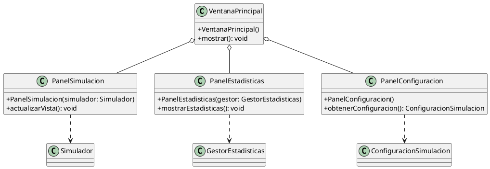

# Descripción del Diagrama UML del Paquete `proyectointegrador.interfaz`

El paquete `interfaz` contiene las clases relacionadas con la interacción del usuario y la visualización de la simulación. Estas clases suelen utilizar entidades del modelo (`Colectivo`, `Linea`, `Parada`, `Pasajero`) para mostrar información o recibir comandos.

## 1. Clases y sus responsabilidades

- **VentanaPrincipal**  
  Ventana principal de la aplicación, contiene y coordina los paneles visuales y el menú.

- **PanelSimulacion**  
  Panel que representa visualmente la simulación (recorrido de colectivos, paradas, pasajeros, etc.), probablemente observa el estado del simulador.

- **PanelEstadisticas**  
  Panel especializado en mostrar estadísticas de la simulación (satisfacción, tiempos de espera, etc.).

- **PanelConfiguracion**  
  Panel para que el usuario configure parámetros de la simulación (cantidad de colectivos, líneas, etc.).

## 2. Relaciones principales

- **Composición:**  
  `VentanaPrincipal` contiene instancias de los paneles.

- **Dependencias hacia lógica/modelo:**  
  Los paneles suelen interactuar con el `Simulador` (lógica) y las entidades del modelo para mostrar información relevante.

---

# Diagrama UML (Versión Resumida)

---

**Notas:**
- Solo se muestran los métodos más representativos, omitiendo getters/setters y constructores triviales.
- Las dependencias a la lógica/modelo se muestran como líneas punteadas `..>`.
- Si necesitas incluir miniaturas de las clases del modelo/lógica para mayor claridad, se pueden agregar fácilmente.

¿Quieres que te arme el diagrama completo (no resumido) para este paquete, o avanzamos con otro?