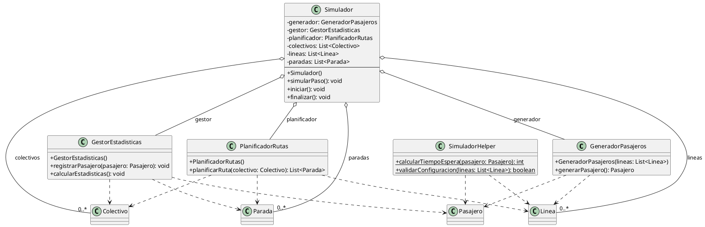

# Descripción del Diagrama UML del Paquete `proyectointegrador.logica`

El paquete `logica` contiene las clases responsables de la simulación, la generación de pasajeros, el manejo de estadísticas y la planificación de rutas. Todas estas clases suelen interactuar con las clases del paquete `modelo` (especialmente `Colectivo`, `Linea`, `Parada` y `Pasajero`).

## 1. Clases y sus responsabilidades

- **GeneradorPasajeros**  
  Encargada de crear instancias de `Pasajero` con orígenes y destinos válidos durante la simulación. Suele recibir referencias a `Linea`, `Parada` o listas de ellas.

- **GestorEstadisticas**  
  Maneja el registro y cálculo de estadísticas de la simulación (por ejemplo, satisfacción, tiempos de espera, etc.). Suele acceder a datos de instancias de `Colectivo`, `Parada` y `Pasajero`.

- **PlanificadorRutas**  
  Determina rutas óptimas o válidas para los colectivos según la configuración de líneas y paradas.

- **Simulador**  
  Clase central de la lógica de simulación. Coordina el avance de los colectivos, la generación de pasajeros y el registro de estadísticas. Puede poseer referencias a la mayoría de las clases anteriores y a elementos del modelo.

- **SimuladorHelper**  
  Clase auxiliar con métodos estáticos para facilitar tareas repetitivas o utilitarias dentro de la simulación (por ejemplo, cálculos, validaciones, etc.).

## 2. Relaciones principales

- **Dependencias hacia el modelo:**  
  Todas las clases de lógica dependen de las entidades del modelo para operar (son usadas como parámetros, atributos o resultados de métodos).
- **Composición/Agregación:**  
  `Simulador` suele contener instancias de `GeneradorPasajeros`, `GestorEstadisticas`, `PlanificadorRutas` y colecciones del modelo.

---

# Diagrama UML (Versión Resumida)

---

**Notas:**
- Solo se muestran los métodos más representativos, omitiendo getters/setters y constructores triviales si no cambian la comprensión del diseño.
- Las dependencias hacia las clases del modelo se muestran como líneas punteadas `..>`.
